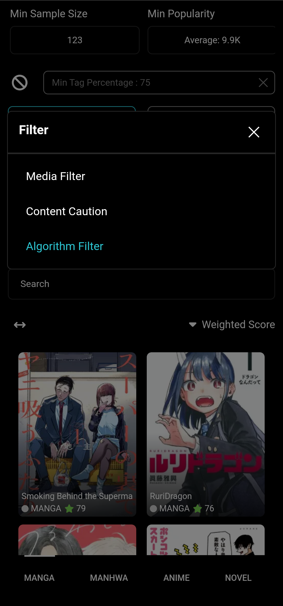
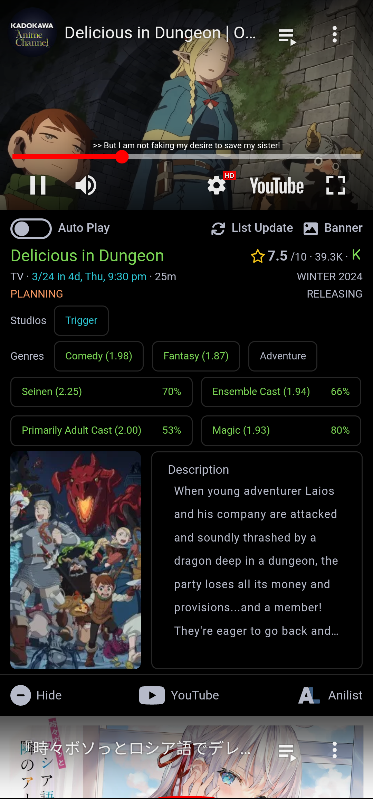
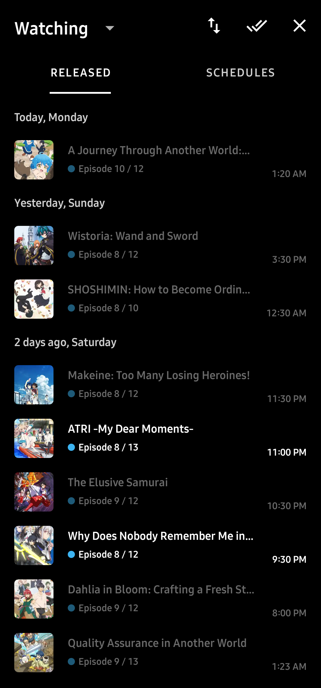
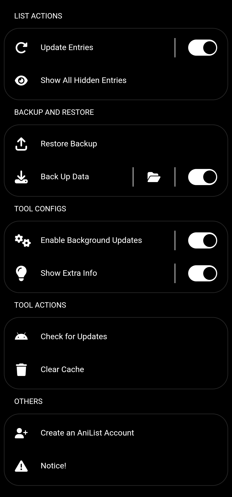
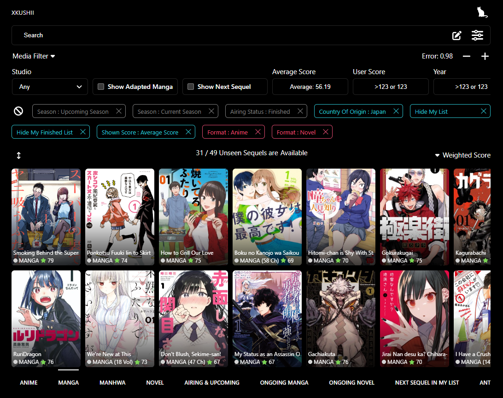
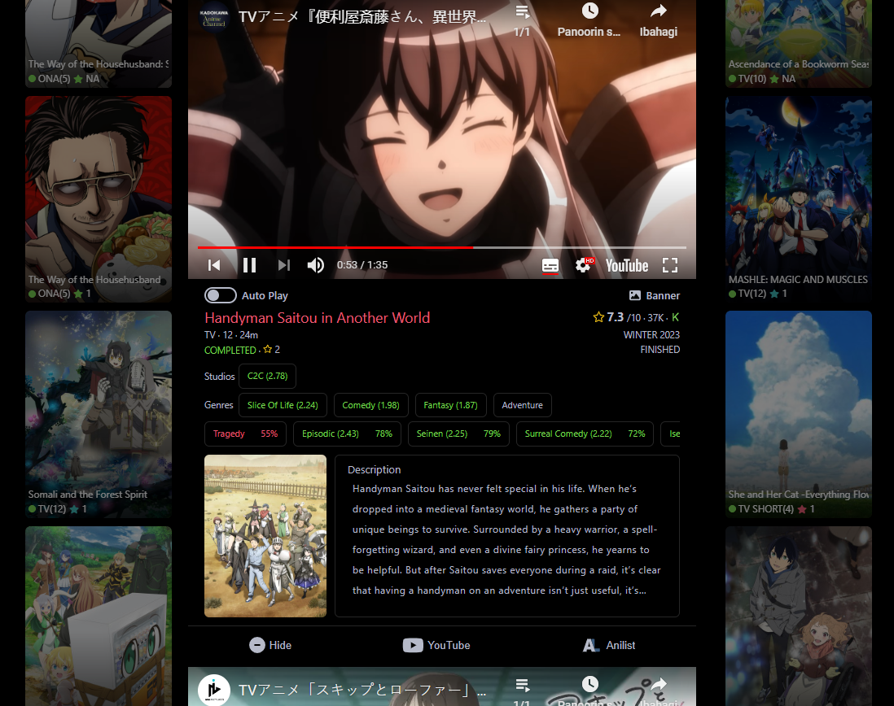

  
  <h2 align="center">Kanshi.</h2>

This app is tailored to offer <b>anime</b>, <b>manga</b> (manhwa, manhua, one shot), and <b>light novel</b> (LN) recommendations by analyzing your <b>personal ratings on AniList</b>.

If you're getting tired of looking for what to see next, this tool can assist you by giving reasonable recommendations based on the <b>contents you liked</b>.

By eliminating the need to depend on others' preferences, it can possibly suggest <b>underrated</b> and <b>underseen</b> series that aligns with your taste.  

The algorithm for its recommendation can be customized, including the option to <b>choose your own features</b> (genres, tags, etc.) and to <b>change its thresholds</b>.  

It's <b>free</b> and <b>runs locally</b> for your convenience.  

<h2 align="center"></h2>

## Android / Website

<h2 align="center"></h2>

## Android Preview

  
  
  
  

<h2 align="center"></h2>

## Website Preview

  
  

<h2 align="center"></h2>

## Additional Information
- [Alternative Website](https://u-kuro.github.io/Kanshi-Anime-Recommender)
 
