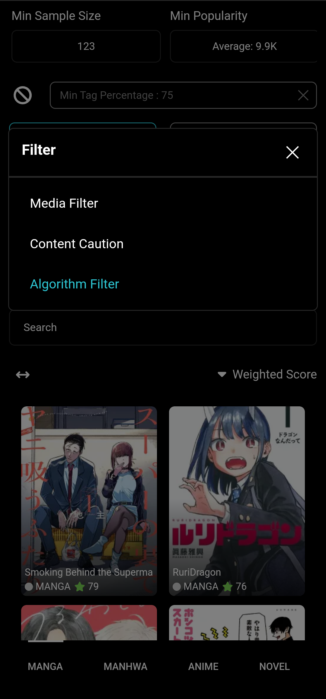
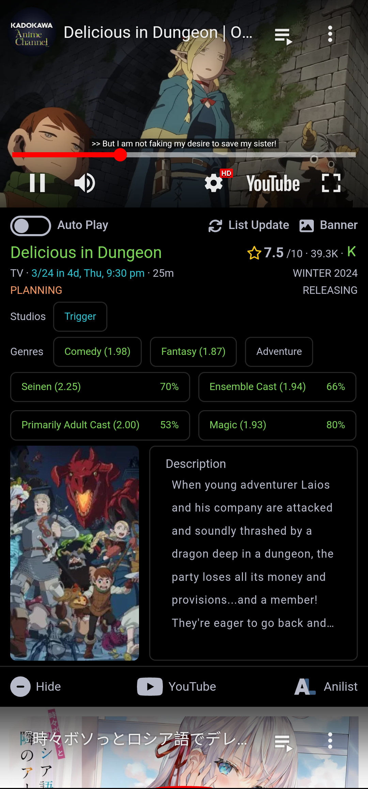
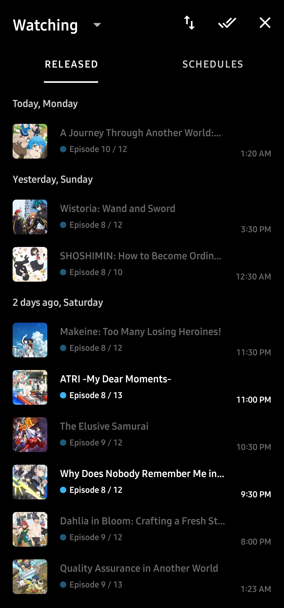
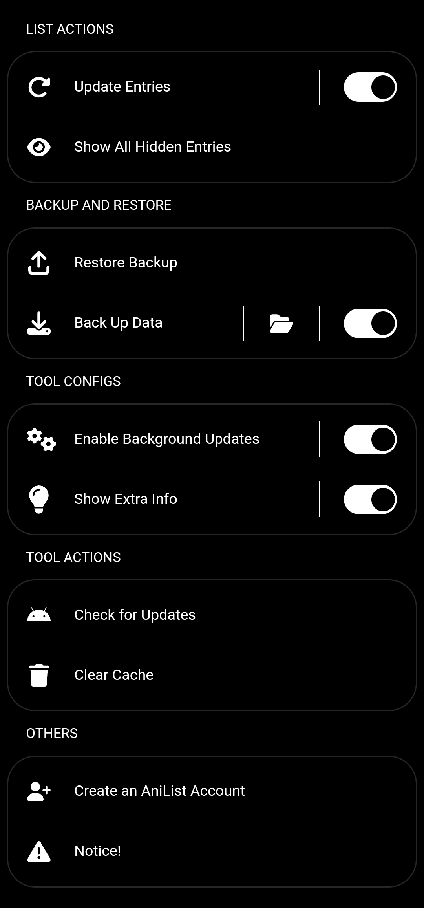
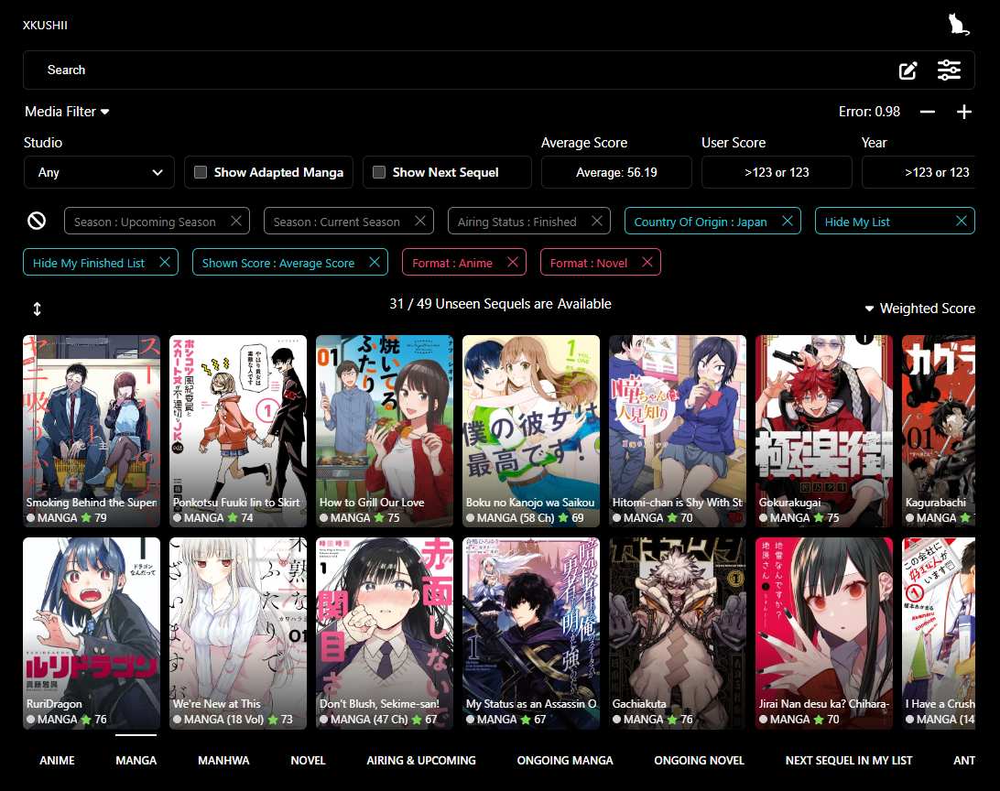
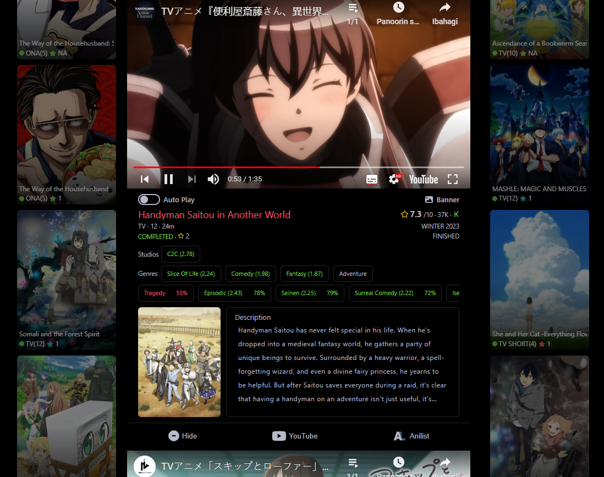

  
  <h1 align="center">Animanga Recommendation System</h1>
  

    
    
  

---

# What Is It
A system that connects to a user's anime tracking account, studies everything they've watched and rated, and produces a personalized ranked list of what to watch or read next across thousands of titles.

---

# What the System Does

The user enters their username from AniList (a popular anime and manga tracking site). It pulls their entire history of rated titles, cross-references it against a built-in catalogue of thousands of anime, manga, and novels, and runs a scoring algorithm trained on their personal taste. The result is a recommendation list ranked from most to least likely to match what they enjoy. The list updates automatically whenever AniList detects a change in the user's account.

---

# Data Sources

| Source | What Is Pulled |
|---|---|
| **Built-in catalogue** | Full details on thousands of anime, manga, and novels — titles, genres, descriptive tags, production studios, community ratings, popularity counts, release dates, and franchise relationships between titles. |
| **User's AniList account** | Everything the user has tracked — what they've watched or read, whether they completed it, their personal rating, and how many episodes or chapters they've gotten through. |
| **AniList (timestamp check)** | A single timestamp of when the user's account last changed. Checked every time the system opens to decide whether a fresh sync is needed. |

---

# What Is Collected Per Title

Every title in the catalogue carries these fields, all of which are used in ranking and filtering:

| Data Point | What It Represents |
|---|---|
| Genres | Broad content categories — Action, Romance, Horror, etc. |
| Descriptive tags | Granular descriptors, each with a relevance percentage specific to that title (e.g. "Time Skip — 78%") |
| Tag groupings | Higher-level categories above individual tags (e.g. "Setting," "Demographic") |
| Production studio | Who made it, flagged as primary or supporting |
| Community rating | Average score given by all AniList users (0–100) |
| Tracking count | How many AniList users have added it to their list |
| Favorites count | How many users have marked it as a favorite |
| Trending rank | Current trending position on AniList |
| Release status | Finished airing · Currently airing · Not yet released · Cancelled |
| Format | TV series · Film · OVA · Web series · Manga · One-shot · Novel |
| Season and year | e.g. Fall 2023 |
| Country of origin | Japan, South Korea, China, etc. |
| Franchise links | Whether this title is a sequel, prequel, adaptation, spin-off, or alternative version of another title |
| Episode / chapter count | Total and how far the user has gotten |
| Next episode air date | Exact timestamp of the upcoming episode for currently airing titles |

---

# How the Recommendation Algorithm Works

## Step 1: Read the user's history and remove duplicates

The user's tracked titles are sorted by their personal rating and by how popular the title is. If a user has rated both a series and its spin-off, the most representative entry is kept and the rest are skipped. This prevents the same underlying taste signal from being counted twice.

## Step 2: Build a preference profile from genres, tags, and studios

For every title the user has personally rated, the algorithm collects all of its genres, tags, and studios. Each genre and studio accumulates the ratings from every title that shares it. Tags accumulate the rating multiplied by how relevant that tag is to the specific title — a tag listed as 95% relevant to a title counts for more than one listed at 40%.

This produces a raw preference score per genre, tag, and studio — essentially a map of what the user tends to enjoy.

## Step 3: Down-weight uncertain preferences

Preferences that appear in very few titles are less reliable. If a genre or tag shows up in fewer titles than average across the user's history, the preference score for it is reduced proportionally. Preferences with below-average scores are penalized further. Only attributes that pass both thresholds carry forward into scoring other titles.

## Step 4: Optionally train two trend models

If the user has rated enough titles, the algorithm fits a simple trend line to two relationships in their history:

- **Release year vs. personal rating** — does the user tend to prefer older or newer titles?
- **Community rating vs. personal rating** — does the user agree with the crowd, or do they diverge?

These produce a predicted rating for any title based solely on its year and community score.

## Step 5: Score every title in the catalogue

For each catalogue title, two things are calculated:

- **Content match** — how well the title's genres and tags align with what the user has historically enjoyed, using the preference profile from Step 2
- **Quality signal** — what the year and community-score trend models predict the user would rate it

These two components are multiplied together to produce a raw score.

## Step 6: Adjust for low popularity and low community rating

A title that almost nobody has tracked is penalized proportionally — the algorithm trusts the preference signal less for obscure titles. Similarly, titles with below-average community ratings for their format (anime vs. manga vs. novel are compared separately) receive a proportional penalty. This prevents niche titles from ranking highly just because they happen to share genres the user likes.

## Step 7: Rescale everything to match the user's rating scale

Every raw score is rescaled to sit within the range the user actually uses. If the user typically rates things between 6 and 9 out of 10, the final scores are compressed into that range. The floor is set at the mean rating minus one standard deviation; the ceiling at the mean plus one standard deviation.

## Step 8: Classify each title into a tier

| Tier | Condition | Meaning |
|---|---|---|
| 🟢 **Strong match** | Score above the average of titles the user has personally scored | The algorithm is confident this fits the user's taste |
| 🟡 **Possible match** | Score above the overall average across all catalogue titles | Moderate signal |
| ⚪ **Weak signal** | Below the overall average | Little evidence this would appeal to the user |

## Step 9: Report how accurate the algorithm is

The algorithm compares its predicted scores against the user's actual ratings and calculates how far off it is on average, as a percentage of the total rating scale. This accuracy figure is shown to the user so they can judge how well the algorithm has learned their taste.

---

## Android Application Preview

  
  
  
  

## Website Preview

  
  

